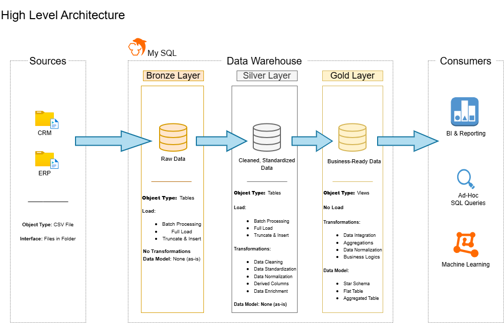
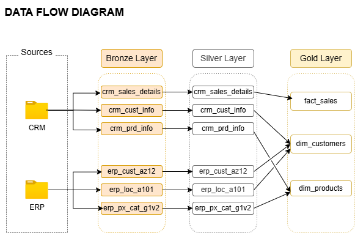

# Data Warehouse and Analytics Project

Welcome to the **Data Warehouse and Analytics Project** repository! 🚀

This project demonstrates a comprehensive data warehousing and analytics solution, from building a data warehouse to generating actionable insights. Designed as a portfolio project highlights best practices in data engineering and analytics.

---

## 📖 Project Overview 

This Project involves:

  1. Data Architecture: Designing a Modern Data Warehouse Using Medallion Architecture Bronze, Silver, and Gold layers.
  2. ETL Pipelines: Extracting, transforming, and loading data from source systems into the warehouse.
  3. Data Modeling: Developing fact and dimesion tables optimized for analytical queries.
  4. Analytics & Reporting: Creating SQL-based reports and dashboards for actionable insights.

---

## 🚀 Project Requirements

### Building the Data Warehouse (Data Engineering)

#### Objective

Develop a modern data warehouse using SQL Server to consolidate sales data,enabling analytical reporting and informed decision-making.

#### Specifications

- **Data Sources**: Import data from two source systems (ERP and CRM) provide as CSV files.

- **Data Quality**: Cleanse and resolve data quality issues prior to analysis.

- **Integration**: Combine both sources into a single, user-friendly data model designed for analytical queries.

- **Scope**: Focus on the latest dataset only; historization of data is not required.

- **Documentation**: Provide clear documentaion of the data model to support both business stakeholders and analytics teams.

---

### BI: Analytics & Reporting (Data Analytics)

#### Objective
Develop SQL-based analytics to deliver detailed insights into:

- **Customer Behavior**

- **Product Performance**

-**Sales Trends**

These insights empower stakeholders with key business metrics, enabling strategic decision-making.

---

## 🏛️ Data Architecture

The data architecture for this project follows Medallion Architecture Bronze, Silver, and Gold Layers:

  - 

---

## 📂 Repository Structure

- **datasets**
  - [crm_cust_info.csv](datasets/bronze.crm_cust_info.csv)
  - [crm_prd_info.csv](datasets/bronze.crm_prd_info.csv)
  - [crm_sales_details.csv](datasets/bronze.crm_sales_details.csv)
  - [erp_cust_az12.csv](datasets/bronze.erp_cust_az12.csv)
  - [erp_loc_a101.csv](datasets/bronze.erp_loc_a101.csv)
  - [er_px_cat_g1v2.csv](datasets/bronze.erp_px_cat_g1v2.csv)

- **scripts**
  
  - [init_database.sql](scripts/init_database.sql)

  - **bronze**
    - [ddl_bronze.sql](scripts/bronze/ddl_bronze.sql)
    - [load_bronze.sql](scripts/bronze/load_bronze.sql)
      
  - **silver**
    - [ddl_silver.sql](scripts/bronze/ddl_silver.sql)
    - [load_crm_cust_info.sql](scripts/silver/load_crm_cust_info.sql)
    - [load_crm_prd_info.sql](scripts/silver/load_crm_prd_info.sql)
    - [load_crm_sales_details.sql](scripts/silver/load_crm_sales_details.sql)
    - [load_erp_cust_az12.sql](scripts/silver/load_erp_cust_az12.sql)
    - [load_erp_loc_a101.sql](scripts/silver/load_erp_loc_a101.sql)
    - [load_erp_px_cat_g1v2.sql](scripts/silver/load_erp_px_cat_g1v2.sql)

  - **gold**
    - [ddl_gold_dim_customers](scripts/gold/ddl_gold_dim_customers.sql)
    - [ddl_gold_dim_products](scripts/gold/ddl_gold_dim_products.sql)
    - [ddl_gold_fact_sales](scripts/gold/ddl_gold_fact_sales.sql)

- **tests**
  
  - **bronze**
    - [quality_checks_crm_cust_info.sql](tests/bronze/quality_checks_crm_cust_info.sql)
    - [quality_checks_crm_prd_info.sql](tests/bronze/quality_checks_crm_prd_info.sql)
    - [quality_checks_crm_sales_details.sql](tests/bronze/quality_checks_crm_sales_details.sql)
    - [quality_checks_erp_cust_az12.sql](tests/bronze/quality_checks_erp_cust_az12.sql)
    - [quality_checks_erp_loc_a101.sql](tests/bronze/quality_checks_erp_loc_a101.sql)
    - [quality_checks_erp_px_cat_g1v2.sql](tests/bronze/quality_checks_erp_px_cat_g1v2.sql)
   
      
  - **silver**
    - [quality_checks_crm_cust_info.sql](tests/silver/quality_checks_crm_cust_info.sql)
    - [quality_checks_crm_prd_info.sql](tests/silver/quality_checks_crm_prd_info.sql)
    - [quality_checks_crm_sales_details.sql](tests/silver/quality_checks_crm_sales_details.sql)
    - [quality_checks_erp_cust_az12.sql](tests/silver/quality_checks_erp_cust_az12.sql)
    - [quality_checks_erp_loc_a101.sql](tests/silver/quality_checks_erp_loc_a101.sql)
    - [quality_checks_erp_px_cat_g1v2.sql](tests/silver/quality_checks_erp_px_cat_g1v2.sql)
   

  - **gold**
    - [quality_checks_dim_customers](tests/gold/quality_checks_dim_customers.sql)
    - [quality_checks_dim_products.sql](tests/gold/quality_checks_crm_dim_products.sql)
    - [quality_checks_fact_sales.sql](tests/gold/quality_checks_crm_fact_sales.sql)

- **docs**
  
  - [Data Catalog](docs/data_catalog.md)

  
  - 

  - 

  - 
  

  - 

- [README.md](README.md)

---

## 🛠️ Technologies Used
- MySQL 8.0 (DDL, DML, window functions, transformations)  
- Git & GitHub  
- VS Code (SQL scripts & CSV exploration)  
- Draw.io (Data flow diagram)

---

## 🛡️ License

This Project is licensed under the [MIT License](LICENSE). You are free to use, modify, and share this project with proper attribution.

## ⭐ About Me

Hi there! I'm **Syed Naveen Nikkath**, an IT professional with experience in data analytics, skilled in SQL, Excel, Power BI, and Python basics. I enjoy working with data to generate insights and build meaningful analytics solutions.

---

## 🧪 Silver Layer Transformations

### Table: crm_cust_info
1. Removed unwanted spaces by trimming first name and last name.  
2. Standardized values using `CASE WHEN` for marital status and gender.  
3. Replaced `NULL` or blank values with `Not Applicable`.  
4. Removed duplicates by retaining the most relevant row per customer.

### Table: crm_prd_info
1. Derived new columns based on existing ones.  
2. Normalized `product_line` and handled missing data as `N/A`.  
3. Applied data type casting where required.  
4. Performed data enrichment to enhance analysis.

### Table: crm_sales_details
1. Handled invalid or missing data for order date, ship date, and due date.  
2. Derived missing or invalid sales values from quantity × price.  
3. Corrected missing or zero prices using sales ÷ quantity calculations.

### Table: erp_cust_az12
1. Removed invalid characters from `cid` using `SUBSTRING`.  
2. Fixed invalid birth dates in `bdate` column.  
3. Normalized gender values and handled missing data.

### Table: erp_loc_a101
1. Removed minus (`-`) characters using `REPLACE`.  
2. Normalized country codes to user-friendly values.  
3. Replaced empty strings and `NULL` with `Not Applicable`.  
4. Trimmed unwanted spaces for consistency.

### Table: er_px_cat_g1v2
1. Verified all columns.  
2. No transformations required as data quality was already correct.

---

